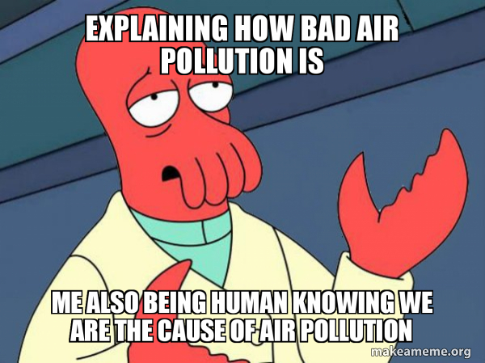

\newpage

```{r setup, include=FALSE}
knitr::opts_chunk$set(echo = TRUE)
```

# Working with Data in R

## Airquality dataset

The \color{red}{airquality} \normalcolor dataset is *built-in* R so there is nothing to install or prepare, it is already there as an \color{green}{R} \normalcolor object. This \color{red}{data} \normalcolor  is small compared to environmental data sets.

### Details of the airquality dataset

Daily readings of the following air quality values for May 1, 1973 a Tuesday to September 30, 1973.

#### Exploring airquality[^1]

[^1]: prova nota

We can look at the first and last few lines of that \color{blue}{airquality} \normalcolor tabular data[^2].

[^2]: questa è la mia seconda nota, c'è anche un link \color{blue}[qui](https://stat.ethz.ch/R-manual/R-devel/library/datasets/html/airquality.html)\normalcolor

# Proviamo a mettere link:

Link [**qui**](https://www.google.com)

## Vai con le liste:

-   Oggi
-   ho
-   imparato
-   cose

1.  Devo
2.  Fare
3.  Cose

> 1.  Devo
> 2.  Fare
> 3.  Cose



```{r,fig.cap = "Using RMarkdown code", echo = FALSE, fig.align='center', out.width="75%"}
knitr::include_graphics(path = "pics/explaining-how-bad-8943e8c056.jpg")
```


@hess2001facial riportano che l'inquinamento fa male

Secondo recenti studi [@hess2001facial], l'inquinamento fa male


Ecco qui una bellissima equazione $3 + 5 = 8$

$$3 + 9 = 12$$
$$ Y = mx + q$$
$$ \Delta = 1 - \pi$$
$\sqrt{4} = 2$


\newpage
# References
